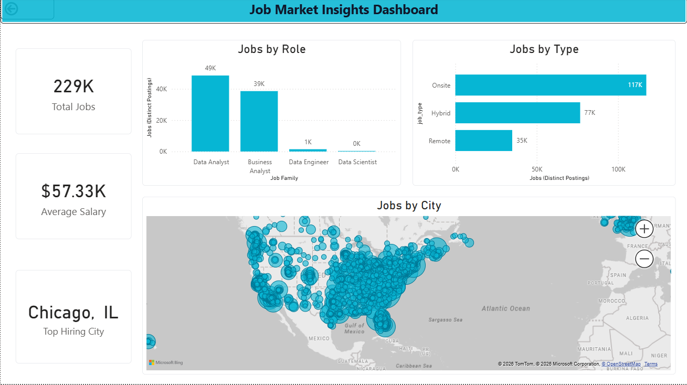
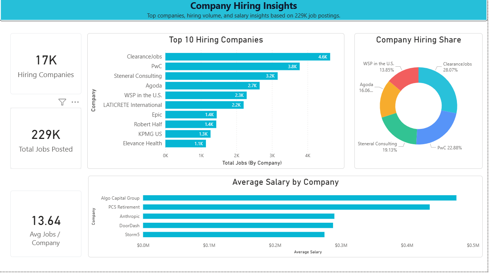
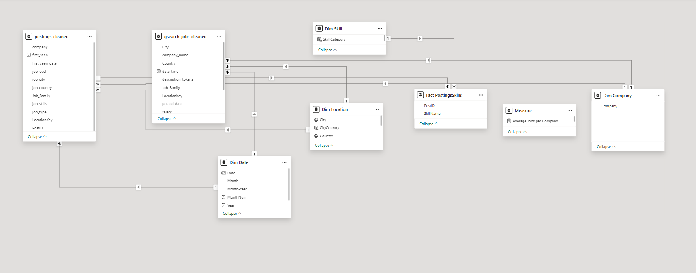
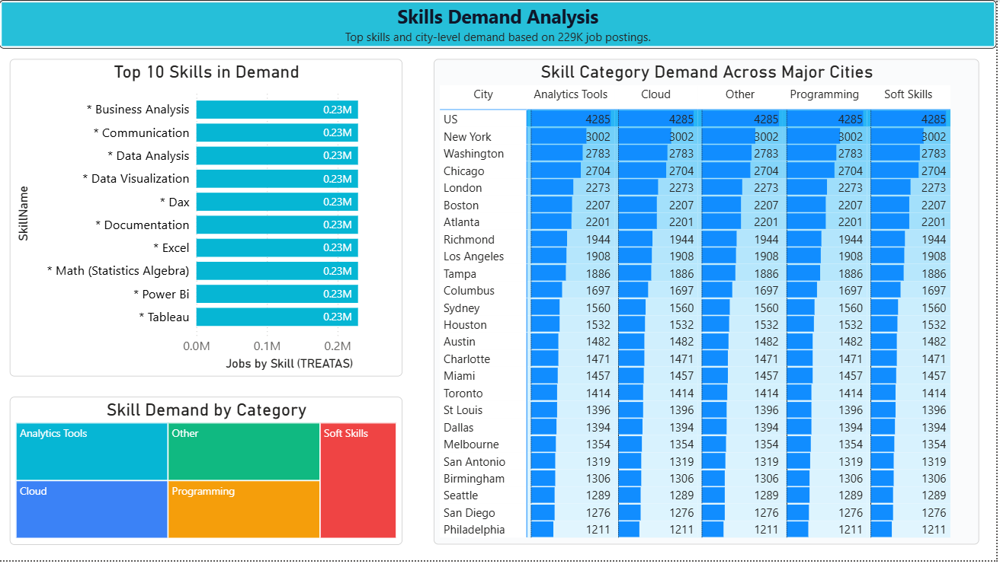

📊 Job Market Insights Dashboard
📝 Project Overview
This project features an interactive data dashboard designed to analyze and visualize current trends in the job market. By processing over 229,000 job postings, the dashboard provides a bird's-eye view of hiring patterns, salary benchmarks, and geographic hotspots for data-related roles.
🚀 Key Features & Metrics
Total Postings: Analyzed a dataset of 229K distinct job listings.

Salary Benchmarking: Identified an average market salary of $57.33K.

Role Distribution: A deep dive into job families showing high demand for Data Analysts (49K) and Business Analysts (39K).

Work Type Trends: Comparison between Onsite (117K), Hybrid (77K), and Remote (35K) positions.

Geographic Mapping: Visualized hiring density across the US, identifying Chicago, IL as the top hiring city.

🛠️ Tech Stack
Data Visualization: [e.g., Power BI / Tableau / Excel]

Mapping Technology: Microsoft Bing Maps Integration
🔍 Key Insights from the Data
Market Demand: The "Data Analyst" role dominates the market, comprising nearly 21% of the total jobs analyzed.

The Return to Office: Despite the rise of remote work, Onsite roles still represent the majority of the market, nearly doubling the volume of Remote-only positions.

Hiring Hubs: Large metropolitan areas in the Midwest and East Coast (like Chicago) remain the primary engines for job growth in the data sector.

📈 High-Level Metrics
Hiring Ecosystem: Features data from 17K unique hiring companies.

Market Scale: Covers a total of 229K job postings.

Company Average: An average of 13.64 jobs posted per company.

🏆 Top Hiring Leaders
The analysis identifies the most active recruiters in the dataset:

ClearanceJobs leads the market with 4.6K postings, holding a 28.07% share among the top 5 hirers.

PwC follows closely with 3.8K postings (22.88% share).

Other major contributors include Steneral Consulting, Agoda, and WSP in the U.S..

💰 Premium Salary Insights
While some companies lead in volume, others lead in compensation. The "Average Salary by Company" chart reveals the highest-paying employers:

Algo Capital Group and PCS Retirement are identified as top-tier payers with average salaries nearing or exceeding $400K - $500K.

Notable tech and AI firms like Anthropic and DoorDash also show strong average salary offerings in the $250K+ range.

To complete your GitHub README, here are the Project Methodology and Technical Implementation sections. These explain how you actually built the dashboard and the logic behind your data model.

⚙️ Project Methodology
The development process was divided into four distinct phases to ensure data integrity and actionable insights:

Data Extraction: Aggregated job posting data from multiple sources, covering a massive scale of 229K total jobs.

Data Transformation (ETL): * Cleaned and standardized job titles into Job Families (e.g., Data Analyst, Business Analyst).

Parsed and categorized raw text into Skill Categories such as Analytics Tools, Cloud, Programming, and Soft Skills.

Normalized company names to accurately track hiring volume across 17K unique companies.

Data Modeling: Established a robust Star Schema relationship between job postings, skills, locations, and dates to allow for seamless cross-filtering.

Dashboard Design: Focused on user-centric design with high-level KPIs and granular drill-down capabilities for roles and cities.

🛠️ Technical Deep-Dive
Data Architecture (The Schema)
The data model is built for performance, utilizing a central fact-based structure:

Fact Tables: postings_cleaned and Fact PostingsSkills act as the core, holding the quantitative data.

Relationships: A 1-to-Many (*) relationship exists between the Dimension tables (Date, Location, Skill, Company) and the Fact tables to ensure data consistency.

Calculated Measures: Developed a dedicated Measure table to house complex DAX logic, such as calculating the Average Jobs per Company (13.64).

Key Analytical Insights
Skill Saturation: Analysis shows a uniform high demand for core competencies like Excel, Power BI, and Tableau, with each appearing in roughly 0.23M postings.

Geographic Concentration: While hiring is global, US cities like New York (3,002) and Washington (2,783) lead in category-specific demand.

Corporate Trends: Market leaders like ClearanceJobs and PwC account for over 50% of the hiring share among the top 5 companies.

🚀 Getting Started
To view or interact with this project:

Clone the repository: git clone https://github.com/yourusername/job-market-analysis.git

Open the File: Load the .pbix (or your tool's file) in Power BI Desktop.

Explore: Use the "Slicers" on the left of each page to filter by Role, City, or Company.

